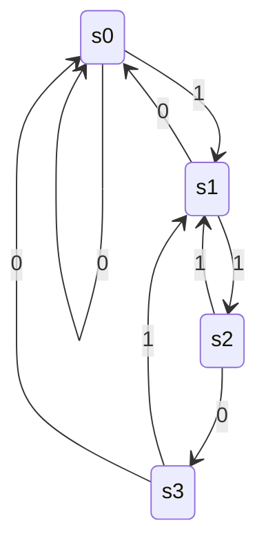

# 数字电路实验报告：**实验 08 信号处理及有限状态机**

姓名：曾舒立；学号：PB19000200；日期：2021/11/28。

## **实验目的** 

进一步熟悉 FPGA 开发的整体流程

掌握几种常见的信号处理技巧

掌握有限状态机的设计方法

能够使用有限状态机设计功能电路

## **实验环境** 

VLAB 平台：vlab.ustc.edu.cn

FPGAOL 平台：fpgaol.ustc.edu.cn

Vivado

Logisim

## 实验过程

### 题目1

改为有限状态机的代码为：

```verilog
module test(input clk,rst,output led);
reg [1:0] cnt_curr;
reg [1:0] cnt_next;

always@(*)
begin
    cnt_next = cnt_curr + 1;
end

always@(posedge clk, posedge rst)
begin
    if(rst)
    cnt_curr <= 2'b0;
    else
    cnt_curr <= cnt_next;
end

assign led = (cnt_curr==2'b11) ? 1'b1 : 1'b0;

endmodule
```

### 题目2

计数器电路如图：


### 实验3

设计文件代码：

```verilog
module d_out(input clk,[31:0] data,output reg [3:0] d,reg [2:0] an);
wire c50hz0,c50hz1,c50hz2,c50hz3,c50hz4,c50hz5,c50hz6,c50hz7;
reg [20:0] count;

always @(posedge clk)
begin
    count <= count + 21'b1;
end
assign c50hz0 = (count == 21'b0_0011111111_1111111111);
assign c50hz1 = (count == 21'b0_0111111111_1111111111);
assign c50hz2 = (count == 21'b0_1011111111_1111111111);
assign c50hz3 = (count == 21'b0_1111111111_1111111111);
assign c50hz4 = (count == 21'b1_0011111111_1111111111);
assign c50hz5 = (count == 21'b1_0111111111_1111111111);
assign c50hz6 = (count == 21'b1_1011111111_1111111111);
assign c50hz7 = (count == 21'b1_1111111111_1111111111);

always @(posedge clk)
begin
    if (c50hz0)
    begin
        d<=data[3:0];
        an<=3'b000;
    end
    if (c50hz1)
    begin
        d<=data[7:4];
        an<=3'b001;
    end
    if (c50hz2)
    begin
        d<=data[11:8];
        an<=3'b010;
    end
    if (c50hz3)
    begin
        d<=data[15:12];
        an<=3'b011;
    end
    if (c50hz4)
    begin
        d<=data[19:16];
        an<=3'b100;
    end
    if (c50hz5)
    begin
        d<=data[23:20];
        an<=3'b101;
    end
    if (c50hz6)
    begin
        d<=data[27:24];
        an<=3'b110;
    end
    if (c50hz7)
    begin
        d<=data[31:28];
        an<=3'b111;
    end
end

endmodule


module week8_3(input clk,sw,button,rst_sw,output [3:0] d, [2:0] an);
reg [31:0] curr_state,next_state_p,next_state_n;

always@(*)
begin
    next_state_p = curr_state + 1;
    next_state_n = curr_state - 1;
end

always@(posedge button)
begin
    if (rst_sw == 1) curr_state<=32'h1F; 
    else
    begin
        if (sw == 1) curr_state<=next_state_p;
        else         curr_state<=next_state_n;
    end
end

d_out d_out(clk,curr_state,d,an);

endmodule
```

管脚约束文件：

```verilog
# This file is a general .xdc for FPGAOL_BOARD (adopted from Nexys4 DDR Rev. C)
# To use it in a project:
# - uncomment the lines corresponding to used pins
# - rename the used ports (in each line, after get_ports) according to the top level signal names in the project

# Clock signal
set_property -dict { PACKAGE_PIN E3    IOSTANDARD LVCMOS33 } [get_ports { clk }];

# FPGA BUTTON
set_property -dict { PACKAGE_PIN B18    IOSTANDARD LVCMOS33 } [get_ports { button }];

# FPGAOL LED (signle-digit-SEGPLAY)

set_property -dict { PACKAGE_PIN A14   IOSTANDARD LVCMOS33 } [get_ports { d[0] }];
set_property -dict { PACKAGE_PIN A13   IOSTANDARD LVCMOS33 } [get_ports { d[1] }];
set_property -dict { PACKAGE_PIN A16   IOSTANDARD LVCMOS33 } [get_ports { d[2] }];
set_property -dict { PACKAGE_PIN A15   IOSTANDARD LVCMOS33 } [get_ports { d[3] }];
set_property -dict { PACKAGE_PIN B17   IOSTANDARD LVCMOS33 } [get_ports { an[0] }];
set_property -dict { PACKAGE_PIN B16   IOSTANDARD LVCMOS33 } [get_ports { an[1] }];
set_property -dict { PACKAGE_PIN A18   IOSTANDARD LVCMOS33 } [get_ports { an[2] }];


# FPGAOL SWITCH

set_property -dict { PACKAGE_PIN D14   IOSTANDARD LVCMOS33 } [get_ports { sw }];
set_property -dict { PACKAGE_PIN F16   IOSTANDARD LVCMOS33 } [get_ports { rst_sw }];

set_property CLOCK_DEDICATED_ROUTE FALSE [get_nets button_IBUF];
```

### 实验4

设计文件代码：

```verilog
module d_out4(input clk,[3:0] seq,cnt,state,output reg [3:0] d,reg [2:0] an);
wire c50hz0,c50hz1,c50hz2,c50hz3,c50hz5,c50hz7;
reg [20:0] count;

always @(posedge clk)
begin
    count <= count + 21'b1;
end

assign c50hz0 = (count == 21'b0_0011111111_1111111111);
assign c50hz1 = (count == 21'b0_0111111111_1111111111);
assign c50hz2 = (count == 21'b0_1011111111_1111111111);
assign c50hz3 = (count == 21'b0_1111111111_1111111111);
//assign c50hz4 = (count == 21'b1_0011111111_1111111111);
assign c50hz5 = (count == 21'b1_0111111111_1111111111);
//assign c50hz6 = (count == 21'b1_1011111111_1111111111);
assign c50hz7 = (count == 21'b1_1111111111_1111111111);

always @(posedge clk)
begin
    if (c50hz0)
    begin
        d<={3'b000,seq[0]};
        an<=3'b000;
    end
    if (c50hz1)
    begin
        d<={3'b000,seq[1]};
        an<=3'b001;
    end
    if (c50hz2)
    begin
        d<={3'b000,seq[2]};
        an<=3'b010;
    end
    if (c50hz3)
    begin
        d<={3'b000,seq[3]};
        an<=3'b011;
    end


    if (c50hz5)
    begin
        d<=cnt;
        an<=3'b101;
    end


    if (c50hz7)
    begin
        d<=state;
        an<=3'b111;
    end
end

endmodule


module week8_4(input clk,sw,button,output [3:0] d, [2:0] an);
reg [3:0] curr_seq,next_seq,curr_cnt,next_cnt,curr_state,next_state;

always@(*)
begin
    next_seq[3:1]=curr_seq[2:0];
    next_seq[0]=sw;
    next_cnt=curr_cnt+1'b1;
    if (curr_state==4'h0)
    begin
        if (sw==0) next_state=4'h0;
        else       next_state=4'h1;
    end
    else if (curr_state==4'h1)
    begin
        if (sw==0) next_state=4'h0;
        else       next_state=4'h2;
    end
    else if (curr_state==4'h2)
    begin
        if (sw==0) next_state=4'h3;
        else       next_state=4'h1;
    end
    else if (curr_state==4'h3)
    begin
        if (sw==0) next_state=4'h0;
        else       next_state=4'h1;
    end
    else next_state=4'h0;
end

always@(posedge button)
begin
    curr_seq<=next_seq;
    curr_state<=next_state;
end

always@(negedge button)
begin
    if (curr_seq==4'b1100) curr_cnt<=next_cnt;
end

d_out4 d_out4(clk,curr_seq,curr_cnt,curr_state,d,an);

endmodule
```

管脚约束文件：

```verilog
# This file is a general .xdc for FPGAOL_BOARD (adopted from Nexys4 DDR Rev. C)
# To use it in a project:
# - uncomment the lines corresponding to used pins
# - rename the used ports (in each line, after get_ports) according to the top level signal names in the project

# Clock signal
set_property -dict { PACKAGE_PIN E3    IOSTANDARD LVCMOS33 } [get_ports { clk }];

# FPGA BUTTON
set_property -dict { PACKAGE_PIN B18    IOSTANDARD LVCMOS33 } [get_ports { button }];

# FPGAOL LED (signle-digit-SEGPLAY)

set_property -dict { PACKAGE_PIN A14   IOSTANDARD LVCMOS33 } [get_ports { d[0] }];
set_property -dict { PACKAGE_PIN A13   IOSTANDARD LVCMOS33 } [get_ports { d[1] }];
set_property -dict { PACKAGE_PIN A16   IOSTANDARD LVCMOS33 } [get_ports { d[2] }];
set_property -dict { PACKAGE_PIN A15   IOSTANDARD LVCMOS33 } [get_ports { d[3] }];
set_property -dict { PACKAGE_PIN B17   IOSTANDARD LVCMOS33 } [get_ports { an[0] }];
set_property -dict { PACKAGE_PIN B16   IOSTANDARD LVCMOS33 } [get_ports { an[1] }];
set_property -dict { PACKAGE_PIN A18   IOSTANDARD LVCMOS33 } [get_ports { an[2] }];


# FPGAOL SWITCH

set_property -dict { PACKAGE_PIN D14   IOSTANDARD LVCMOS33 } [get_ports { sw }];

set_property CLOCK_DEDICATED_ROUTE FALSE [get_nets button_IBUF];
```

（即是题目3中管脚约束文件删去rst_sw的一行）

按照“0011001110011”输入后的显示如下





## **总结与思考** 

1. 请总结本次实验的收获

   学会了用有限状态机的方式编写verilog，以及信号去抖动和去边沿的方法。

2. 请评价本次实验的难易程度

   略困难。

3. 请评价本次实验的任务量

   偏大。

4. 请为本次实验提供改进建议

   暂无。